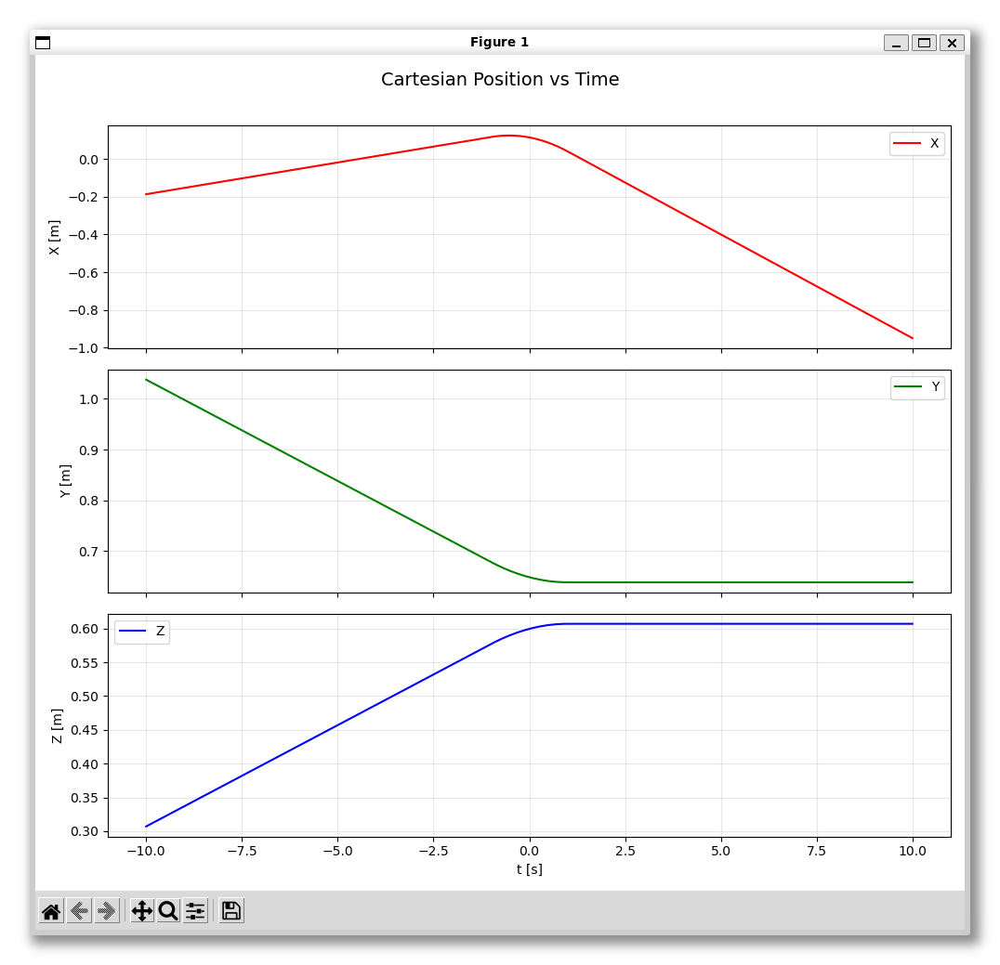

# Lab 1: Cartesian trajectory planning

Este repositorio contiene la implementación en ROS 2 (C++) de un generador de trayectorias cartesianas para el efector final (End-Effector) de un brazo robótico. El proyecto se divide en dos fases principales: la interpolación lineal básica y la generación de una trayectoria suavizada utilizando el método de Taylor.

---

## Compilación y Ejecución
Clona este repositorio dentro de la carpeta src de tu espacio de trabajo de ROS 2 y compila el paquete:
```bash
cd ~/ros/amp_rob_ws/src
git clone https://github.com/rumonru05-byte/cartesian_trajectory_planning.git
cd ~/ros/amp_rob_ws
colcon build --packages-select cartesian_trajectory_planning
source install/setup.bash
```

Ejecuta esto en una terminal para lanzar el brazo manipulador en `RViz`:
```bash
ros2 launch cartesian_trajectory_planning r6bot_controller.launch.py
```

Para poder visualizar la trayectoria del efector final (EE) en `RViz`:
* En el panel de la izquierda, despliega _RobotModel > Links > tool0_ (o el eslabón que corresponda a tu efector final).
* Activa la casilla _Show Trail_.

Y ejectuta esto en otra terminal para lanzar el nodo `send_trajectory`:
```bash
ros2 launch cartesian_trajectory_planning send_trajectory.launch.py
```

---

## Descripción de los Ejercicios

### Ejercicio 1: Interpolación Cartesiana
Se ha implementado la función `PoseInterpolation`, la cual genera poses intermedias entre dos puntos dados. 
* **Posición:** Interpolación lineal (Lerp) utilizando `tf2::Vector3`.
* **Orientación:** Interpolación esférica lineal (Slerp) para cuaterniones utilizando `tf2::Quaternion`.
* La transición se controla mediante la variable `lambda` normalizada de tiempo real.

### Ejercicio 2: Generación de Trayectoria Suave
Se ha implementado la función `ComputeNextCartesianPose` para evitar cambios bruscos de velocidad al transitar entre múltiples puntos ($P_0$, $P_1$, $P_2$).
* Se aplica el **método de Taylor** para crear transiciones curvas (parabólicas) en los puntos de paso intermedios.
* El movimiento está regido por dos parámetros configurables: el intervalo de transición ($\tau$) y el tiempo de recorrido de los segmentos rectos ($T$).

---

## Resultados y gráficas
A continuación se muestra el funcionamiento del brazo manipulador con trayectoria suavizada.


Desde diferentes puntos de vista:
<p align="center">
  
  
</p>

Las gráficas tanto de posición como de orientación del manipulador serían las siguientes:
<table>
  <tr>
    <td align="center">
      <strong>Posición del EE</strong><br>
      </video>
    </td>
    <td align="center">
      <strong>Orientación del EE</strong><br>
      </video>
    </td>
  </tr>
</table>

### Análisis de los resultados
En las gráficas superiores se representa la evolución temporal de la posición cartesiana (X, Y, Z) y la orientación (Roll, Pitch, Yaw) del efector final durante la ejecución de la trayectoria.El efecto del método de suavizado de Taylor es claramente visible en la parte central de las gráficas (en torno a $t = 0$). En lugar de presentar intersecciones angulosas al transitar por el punto intermedio $P_1$ (lo cual implicaría una aceleración teórica infinita y un estrés mecánico perjudicial para el robot), las curvas muestran transiciones perfectamente enlazadas.

Cabe destacar que el pico abrupto que presenta la gráfica de orientación en el eje _Yaw_ (saltando de $-1.57 rad$ a $0$ al final de la trayectoria) no representa un movimiento físico brusco del robot ni un error de cálculo. Este salto se debe al fenómeno matemático conocido como Gimbal Lock, el cual sucede cuando el ángulo de pitch alcanza los $-\pi/2$ rad ($-90^\circ$). En este punto singular, los ejes de rotación de roll y yaw se alinean espacialmente, creando una ambigüedad que el script de visualización resuelve forzando el yaw a cero al intentar graficar los datos usando ángulos de Euler.
